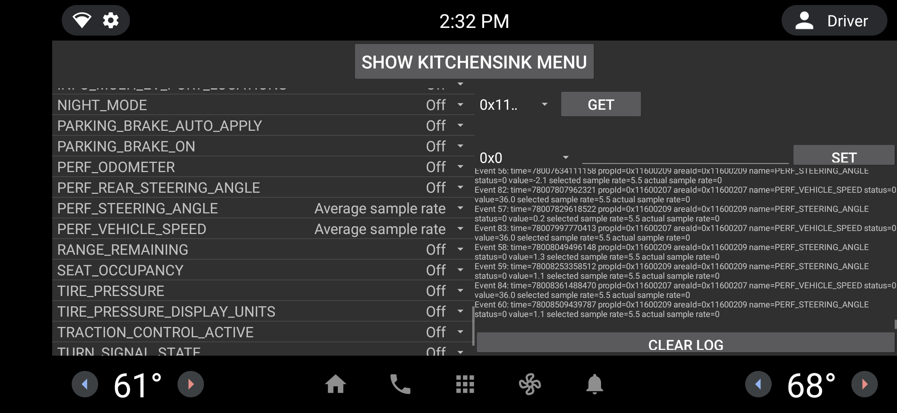

# Set up and build android AAOS for Pixel 4a - stream on/offline data from remotiveLabs cloud

This guide is basically a copy of https://source.android.com/docs/devices/automotive/start/pixelxl, but first new version of git and repo are fetched.

```
sudo add-apt-repository ppa:git-core/ppa
sudo apt-get update
sudo apt-get install git-core gnupg flex bison build-essential zip curl zlib1g-dev gcc-multilib g++-multilib libc6-dev-i386 libncurses5 lib32ncurses5-dev x11proto-core-dev libx11-dev lib32z1-dev libgl1-mesa-dev libxml2-utils xsltproc unzip fontconfig
sudo apt install python

#install repo
mkdir -p ~/.bin
PATH="${HOME}/.bin:${PATH}"
echo 'export PATH="${HOME}/.bin:${PATH}"' >> ~/.bashrc
curl https://storage.googleapis.com/git-repo-downloads/repo > ~/.bin/repo
chmod a+rx ~/.bin/repo

git config --global user.email "YOUR_MAILADRESS"
git config --global user.name "YOUR NAME"

#according to google instructions
mkdir aaos_on_phone
cd aaos_on_phone
repo init -u https://android.googlesource.com/platform/manifest -b android-12.0.0_r3 --use-superproject --partial-clone --partial-clone-exclude=platform/frameworks/base --clone-filter=blob:limit=10M
repo sync -j8 -c -q

#For pixel 4a
curl --output - https://dl.google.com/dl/android/aosp/google_devices-sunfish-sp1a.210812.016.a1-e0021644.tgz  | tar -xzvf -
tail -n +315 extract-google_devices-sunfish.sh | tar -zxvf -

curl --output - https://dl.google.com/dl/android/aosp/qcom-sunfish-sp1a.210812.016.a1-1827786a.tgz | tar -xzvf -
tail -n +315 extract-qcom-sunfish.sh | tar -xzvf -

. build/envsetup.sh
lunch aosp_sunfish_car

# once you executed m you need to wait for a few hours!
m

m android.hardware.automotive.audiocontrol@1.0-service android.hardware.automotive.vehicle@2.0-service
```

>Swedish :) Vad gäller flashning hoppas jag ni kan följa deras guide, annars får ni höra av er. Dock bootar det inte till homescreen efter jag flashat med fastboot, men adb root, remount och sync fungerar. Efter automotive binärerna är på plats bootar det till homescreen.

## Build and replace grpc-service

Put the code in for example: `aaos_on_phone/vendor/remotivelabs/grpc-service`, like so:
```
~/aaos_on_phone/vendor/remotivelabs$ cp -r ~/remotivelabs-samples/integrations/android-vhal/grpc-service .
```

Unless already done you should do:

```
# from aaos_on_phone folder
. build/envsetup.sh
lunch aosp_sunfish_car	
```
build by doing:
```
m grpc-service
```
On the device, unless it has already been done since last boot
```
adb root && sleep 5 &&  adb remount
```
Copy to the pixel 4a by doing:
```
adb sync
```

Make sure the network is available

Start the `grpc-service`:

```
adb shell /system_ext/bin/grpc-service vhal-robert-beamydemo2-jnjbmq2tja-ez.a.run.app API_KEY
```
Make sure the credentials match, go to the `cloud.remotivelabs.com`, and start the recording, click play.

To see output in log
```
adb logcat | grep grpc
```
To see the signals in Kitchen Sink selinux needs to be set to permissive on top of `adb root`. This needs to be done after each reboot.
```
adb shell setenforce 0
```
Dicslaimer: VHAL crashes when the grpc-service is closed. I've tried to close the socker properly but it didn't help. Can'f find a way on how to fix this from the socket client, probably we need to patch VHAL to make it behave nice.

In your pixel you can now start KITCHEN SINK and navigate to PROPERTY TEST and select relevant signals such as `PERF_STEERING_ANGLE` or `PERF_VEHICLE_SPEED`

You should now see the following. If the app reports "Failed to get VHAL property" force quitting KITCHEN SINK helps.




> If you build on a build server/remote server you can still use adb, inspiration here http://www.tinmith.net/wayne/blog/2015/11/android-remote-adb.htm

## Reflections/inspirations

This is done with inspiration from [https://android.googlesource.com/platform/packages/services/Car/+/master/tools/emulator](https://android.googlesource.com/platform/packages/services/Car/+/master/tools/emulator)

https://discuss.96boards.org/t/android-automotive/4299/140

https://source.android.com/docs/devices/automotive

location
https://android.googlesource.com/platform/hardware/interfaces/+/master/gnss/1.0/types.hal

### VehiclePropertyIds
https://developer.android.com/reference/android/car/VehiclePropertyIds
